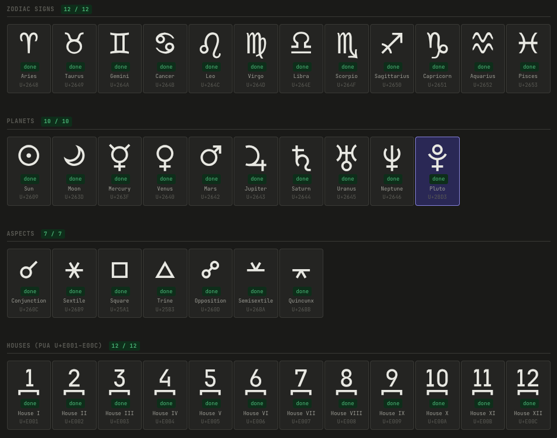
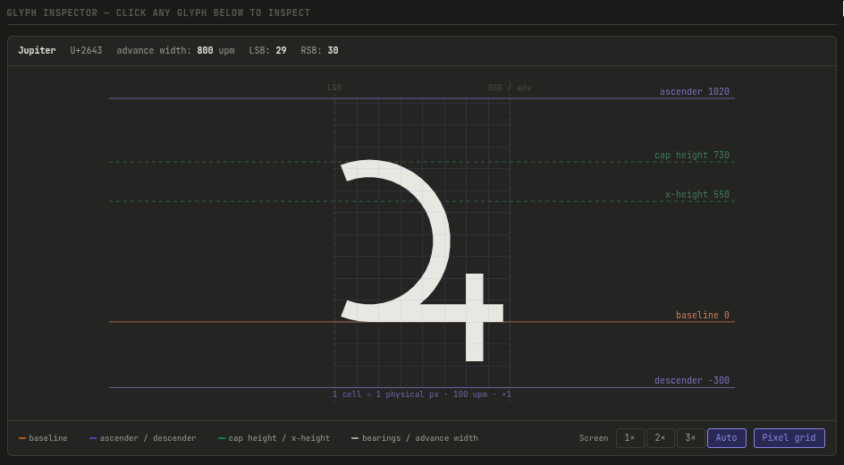

# AstroPan Mono

[Читать на русском](docs/README.ru.md)

**AstroPan Mono** is a specialized icon font for astrological interfaces. It is designed for maximum clarity at small sizes (from **10px**) while strictly adhering to a monospaced grid.



The project is inspired by the engineering solutions of **JetBrains Mono**, adapting them to the specifics of complex astrological graphics.

[**Live Demo & Specimen**](https://paulbunch.github.io/astropan-mono/)

---

## Key Features

* **Grid-aware geometry (10px):** The geometry of the signs is optimized for a 10-pixel grid. The chosen width of **800 UPM** (8 pixels at 10px size) provides the ideal balance between compactness and legibility for complex symbols.
* **Main stroke (80 UPM):** The main stroke width of 0.8px (at 10px) is mathematically optimal. It preserves maximum counter-space and guarantees clear, controlled anti-aliasing without turning the sign into a “blob”.
* **JetBrains Mono compatibility:** All vertical metrics (Ascender, Descender, Cap Height, x-Height) are fully synchronized with JetBrains Mono.
* **Strict grid:** All nodes and outline parameters are aligned to a minor step of 10 units, ensuring clean shapes during rasterization.

---

## Technical Specifications

| Parameter              | Value            |
| :--------------------- | :--------------- |
| **Units Per Em (UPM)** | 1000             |
| **Advance Width**      | 800 UPM          |
| **Main Stroke**        | 80 UPM           |
| **Thin Stroke**        | 50 UPM           |
| **Target Size**        | 10px             |
| **Formats**            | `.woff2`, `.ttf` |

[More details in the specification](docs/spec.md)

---

## Design Groups

1. **Planets and aspects:** Strict geometric shapes with a unified stroke width. Planetary glyphs are based on the circle.
2. **Zodiac signs:** Calligraphic approach with manual stroke compensation to preserve recognizability within the limited 800 UPM space.

[More about design](docs/design-decisions.md)

---

## Font Set (v1.1)

The set includes **44 symbols**:

  * **Zodiac (12):** Standard Unicode positions
  * **Planets (10):** The main septener + outer planets
  * **Aspects (7):** Major and minor aspects (0°, 30°, 60°, 90°, 120°, 150°, 180°)
  * **Houses (12):** Located in the **PUA** area (`U+E001`–`U+E00C`)
  * **Icons (3):** 'Anticlockwise', 'Crystal Ball', 'Eye'

---

## Usage

Microtypography in web (CSS):

```css
@font-face {
  font-family: 'AstroPan Mono';
  src: url('https://paulbunch.github.io/astropan-mono/dist/AstroPanMono-Regular.woff2') format('woff2');
  font-weight: normal;
  font-style: normal;
  font-display: block;
}

.astro-icon {
  font-family: 'AstroPan Mono', monospace;
  font-size: 10px;
  line-height: 1;
  -webkit-font-smoothing: antialiased;
  -moz-osx-font-smoothing: grayscale;
}
```

---

## Development & Build

The project uses an automated pipeline: custom scripts convert **SVG sources** to **UFO** format, after which the font is compiled via **fontmake**.

### Project Structure

* `src/glyphs/` — source SVG vectors for symbols
* `src/config.toml` — font parameters (naming, metrics) separate from graphics
* `scripts/build.py` — main build script
* `docs/spec.md` — technical specification

### Build

Requires **Python 3.11+** (uses the standard `tomllib` library).

The script automatically imports vectors from Inkscape, normalizes curves, and generates font files:

```bash
# Install dependencies
pip install -r requirements.txt

# Run build
python scripts/build.py
```

### Testing

For visual control, there is an interactive page [specimen.html](docs/specimen.html). The specimen allows you to check glyph rendering on Canvas and monitor pixel-perfect alignment on the physical monitor grid.

[Live Specimen](https://paulbunch.github.io/astropan-mono/)



### Quality Check (optional)

You can run an automated quality check using **FontBakery**:

```bash
pip install fontbakery
fontbakery check-universal dist/AstroPanMono-Regular.ttf
```

---

## Thanks

* **[JetBrains Mono](https://github.com/JetBrains/JetBrainsMono)** — for inspiration and open metrics
* **[Inkscape](https://gitlab.com/inkscape/inkscape) & [FontForge](https://github.com/fontforge/fontforge) & [OpenType](https://github.com/opentypejs/opentype.js)** — for accessible tools
* **[Google Fonts / Fontmake](https://github.com/googlefonts/fontmake)** — for the build toolchain
* **[Unified Font Object (UFO)](https://github.com/unified-font-object/ufo-spec)** — for the universal data format
* **[FontBakery](https://github.com/googlefonts/fontbakery)** — for automated quality assurance and font validation
* **AI Collaborators (Gemini, Claude, Grok)** — for help in designing the build architecture and pipeline automation

---

## License

Distributed under the **SIL Open Font License 1.1**. You are free to use, study, modify, and distribute it as long as authorship is preserved. The license text is in [LICENSE](LICENSE).

---

*This project is part of the AstroPan ecosystem.*
